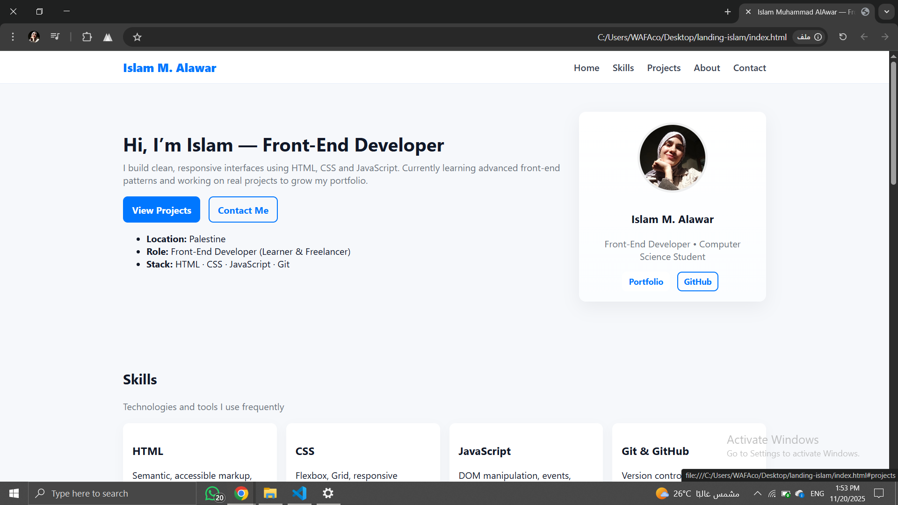

# Portfolio Landing Page

A responsive Front-End portfolio landing page built with **HTML, CSS, and JavaScript**.  
Includes an interactive **Notes Demo** and **Contact Form** (saved locally using LocalStorage).

## Screenshot

## Features

- Responsive layout using **CSS Grid & Flexbox**
- Interactive Notes Demo with add/edit/delete functionality
- Contact Form saving messages locally for demo purposes
- Smooth scrolling navigation and mobile-friendly design

## Technologies Used

- HTML5
- CSS3 (Flexbox & Grid)
- JavaScript (DOM manipulation, events, LocalStorage)

## Live Demo

You can preview the page directly via [GitHub Pages](#) once deployed.

## Author

Islam Muhammad AlAwar — Front-End Developer  
[GitHub](https://github.com/islamalaw3r)

